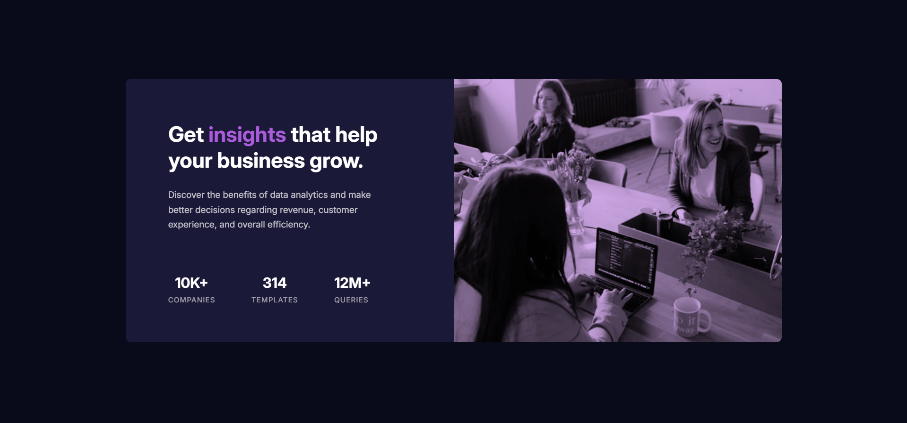
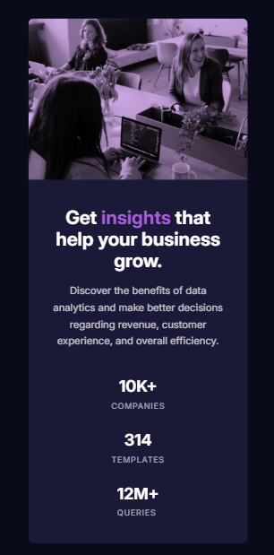

# Frontend Mentor - Stats Preview Card Component solution with React ⚛️✅


This is a solution to the **[Stats Preview Card Component challenge on Frontend Mentor](https://www.frontendmentor.io/challenges/stats-preview-card-component-8JqbgoU62)** by **[Dacardonac](https://github.com/Dacardonac)**. Frontend Mentor challenges help you improve your coding skills by building realistic projects with Frontend.

## Table of contents 📄

- **Frontend Mentor - Stats Preview Card Component**
  - **[Table of contents](#table-of-contents-)**
  - **[Overview](#overview-)**
    - [The challenge](#the-challenge-)
    - [Screenshot](#screenshots-)
    - [Links](#links-)
    - [How to use](#how-to-use-the-project-)
  - **[My process](#my-process-)**
    - [Built with](#built-with-)
    - [What I learned](#what-i-learned-)
    - [Continued development](#continued-development-)
    - [Useful resources](#useful-resources-)
  - **[Author](#author-)**
  - **[Acknowledgments](#acknowledgments-)**

## Overview

### The challenge 🧩

**Users should be able to see in this project:**

- View the optimal layout depending on their device's screen size only between mobile and desktop (Responsive)
- Styles in Components and modules (Sass/Scss)
- React Components
- Accessibility (a11y)
- BEM Methodology

### Screenshots 📷

Desktop 🖥️

****


Mobile 🤳

****


### Links 📍

- Solution URL: **[Frontend Mentor Solution 👨‍💻](https://www.frontendmentor.io/solutions/stats-preview-card-component-with-react-Ht0x24riSu)**
- Live Site URL: **[Solution Deploy in Vercel 🚀](https://fem-stats-preview-card-component-zeta.vercel.app/)**

### How to Use the Project 💻

To use this project, you need to follow these steps:

1. **Clone the repository**:

  ```bash
  git clone https://github.com/Dacardonac/fem-stats-preview-card-component.git
  ```

2. **Navigate to the project directory 📂**:

  ```bash
  cd fem-stats-preview-card-component
  ```

3. **Install dependencies ⬇️: Make sure you have Node.js installed, then run**:

  ```bash
  npm install
  ```

4. **Run the project ▶️: Start the development server with**:

  ```bash
  npm run dev
  ```
  This will start the project locally, typically accessible at `http://localhost:3000`.

5. **If you want to see a preview of the project ▶️**:

  ```bash
  npm run build
  npm run preview
  ```
  **This will start the Preview server on `http://localhost:5173`.**

## My process 🎓

### Built with 🛠

- HTML5 - Structure
- CSS3 Custom Properties - Styles
- React JSX - Programming Logic and Components
- Mobile-first Workflow
- Flexbox - Spaces and Alignments
- Conventional Commits - Commit Specification
- [Vite](https://vitejs.dev/) - Frontend Tooling
- [Sass/Scss](https://sass-lang.com/) - Modules and Styles
- Markdown - README.md file (Documentation)
- BEM Methodology

### What I learned 🧠

With this project, I learned, implemented, and practiced **React - JSX**, along with its properties and methods like **Props**. I also reinforced and practiced my **CSS3** knowledge with **Sass/Scss modules**, worked on semantic **HTML5** by applying the **BEM** methodology for class naming and **Componets**.

**You can see an example below:**

``` JSX
import './App.scss';
import Card from './components/card/Card';

function App() {
  return (
    <>
      <Card />
    </>
  );
}

export default App;
```
``` JSX
import { StrictMode } from 'react';
import { createRoot } from 'react-dom/client';
import './main.scss';
import App from './App.jsx';

createRoot(document.getElementById('root')).render(
  <StrictMode>
    <App />
  </StrictMode>,
);
```
``` JSX
import Illustration from '../illustration/Illustration';
import Stats from '../stats/Stats';
import s from '../stats/Stats.module.scss';
import c from './Card.module.scss';

const Card = () => {
  return (
    <article className={c.card}>
      <Illustration description={'Header Illustration'} />
      <Stats
        title={
          <>
            Get <span className={s['stats__title--violet']}>insights</span> that
            help your business grow.
          </>
        }
        paragraph={
          'Discover the benefits of data analytics and make better decisions regarding revenue, customer experience, and overall efficiency.'
        }
        companies={'10K+'}
        templates={'314'}
        queries={'12M+'}
      />
    </article>
  );
};

export default Card;
```

### Continued development 🔎

I want to continue learning more about **React**, **Responsive Design** and how to work across different devices with **Flexbox** and **@media**, also I want continue using  **BEM methodology** and perfect the technique in aspects like name the classes and components, also I want to improve in modularize the components styles with **Sass modules**, learn about **Conventional Commits** and keep using **Vite**.

### Useful resources 🛠

- **[MDN](https://developer.mozilla.org/en-US/)** - This helped me with **Documentation** on many topics, mostly with **HTML** and **CSS** properties.
- **[ChatGPT](https://chatgpt.com/)** - This is an incredible **Artificial Intelligence (AI)** tool, **ChatGPT** helps me with **specific topics**, **errors in the project** and **investigations**.

## Author 👨‍💻

- Frontend Mentor - **[@Dacardonac](https://www.frontendmentor.io/profile/Dacardonac)**
- LinkedIn - **[@Daniel Alejandro Cano Cardona](https://www.linkedin.com/in/daniel-alejandro-cano-cardona/)**

## Acknowledgments 🙌

I want to thank **[Jairovg](https://github.com/jairovg)** for the teachings and his help to complete this challenge in a good way and with good practices.

**thank you frontend mentor for promoting learning and providing knowledge with these challenges** 🙌

**Have fun building!** 🚀
